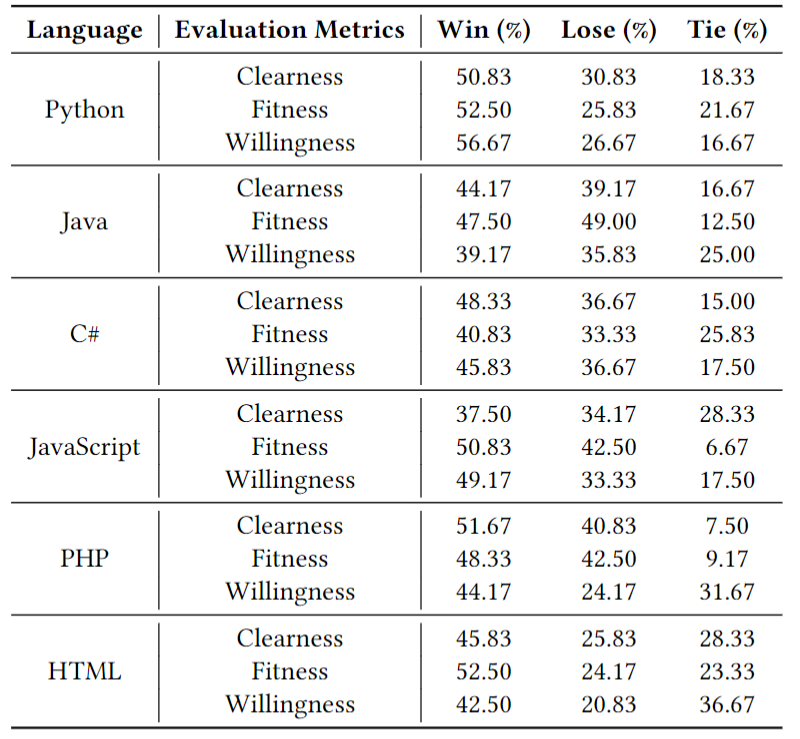

Below are some additional appendices added during the peer review, including:

## Some examples of prompt tuning contribution to generated titles

| Language   | Prompt-tuning                                                | Fine-tuning                                                  | URL                                          |
| ---------- | ------------------------------------------------------------ | ------------------------------------------------------------ | -------------------------------------------- |
| Python     | How do I change variables in a function in python?           | How to change variables in python script                     | https://stackoverflow.com/questions/51564669 |
| Java       | Difference between spring-data-jpa and spring-boot-starter-data- | Spring Boot 2 JPA                                            | https://stackoverflow.com/questions/44768112 |
| JavaScript | Setting a variable equal to another variable in JavaScript   | JavaScript: Why is a variable not modified when we set it to another variable? | https://stackoverflow.com/questions/50840293 |

We can find that prompt-tuning is more informative and natural than fine-tuning in these examples. Moreover, titles generated by prompt-tuning are more similar to ground truth titles (which can be found in the URL) than those generated by fine-tuning.

## Edge cases of SOTitle+ in human study

We selected and analysed some edge cases in human study.

We share the results in the [Google table](https://docs.google.com/spreadsheets/d/17e_MBkhABYYVkYDRhY1o7SeTRiirYNROn8-mABD0SkY/edit?usp=sharing)

## User Study results

Here is our user study results. Detailed votes can be found in [Google table](https://docs.google.com/spreadsheets/d/1mrl02Mkq-dolArN11X4ccU6DPhJQpU2glObRnUC452M/edit?usp=sharing)

