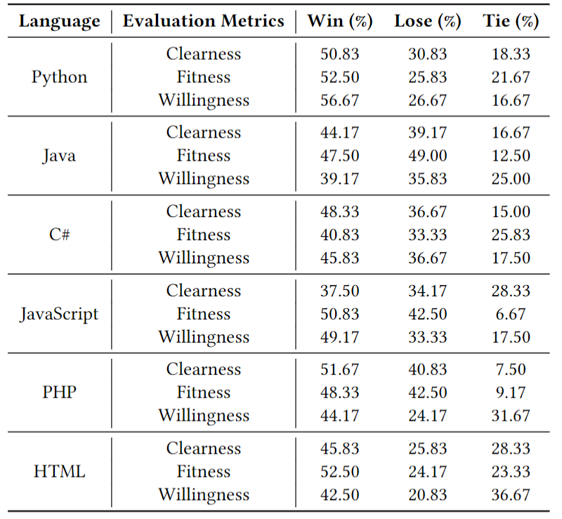

# SOTitle+: Automatic Bi-modal Question Title Generation for Stack Overflow with Prompt Learning

## Introduction
The framework of our proposed approach `SOTitle+`


## Corpus
If you want to download our datasets, [please click here](https://drive.google.com/drive/folders/1305VgV-ZvanfPvfBnKeZeQjbnJPA-PPs?usp=sharing)

### data_prepare
In [`./data_prepare`](./data_prepare), we provide our data_prepare scripts. If you want to download the original data dump log, please refer to [https://archive.org/download/stackexchange](https://archive.org/download/stackexchange). Then use our shared scripts to filter and split the corpus.

## Model
We provide our model, [please click here](https://drive.google.com/drive/folders/1M_1XvJ0MrGlDB_T7jtK_Cb9SiWToh13z?usp=sharing).

## Experimental replication
In [`./model_model`](./model_code), We shared the script to replicate the experimental data in our paper
#### Replication step
1. Clone the repo
   ```shell
   git clone https://github.com/shaoyuyoung/SOTitlePlus.git
   ```
2. Mkdir a `data` catalogue in the root directory and [download the datasets](https://drive.google.com/drive/folders/1305VgV-ZvanfPvfBnKeZeQjbnJPA-PPs?usp=sharing) in `data` catalogue. 
3. Make sure your version of python is ``python3.9`` (Due to compatibility [issue](https://github.com/Maluuba/nlg-eval/issues/149) with the [nlg-eval library](https://github.com/Maluuba/nlg-eval), we ``do not support python3.10`` or later)
4. Install the dependencies according to the requirements file
   ```shell
   pip install requirements.txt
   ```
5. Training and evaluating the model (fine-tuning and prompt-tuning in this phase)
    ```shell
   python model_code/main.py 
   ```
6. Calculating the metrics
   ```shell
   python results/metrics.py
   ```
If you have any questions on replication, please feel free to report in the [issue](https://github.com/shaoyuyoung/SOTitlePlus/issues)🤗


## Results
In [`./results`](./results), run [`metrics.py`](./results/prompt-tuning/metrics.py) to calculate ROUGE, METEOR, BLEU and CIDEr


## Edge cases of SOTitle+ in human study
We selected and analysed some edge cases in human study.<br>
We share the results in the [Google table](https://docs.google.com/spreadsheets/d/17e_MBkhABYYVkYDRhY1o7SeTRiirYNROn8-mABD0SkY/edit?usp=sharing)

## User Study results
Here is our user study results. Detailed votes can be found in [Google table](https://docs.google.com/spreadsheets/d/1mrl02Mkq-dolArN11X4ccU6DPhJQpU2glObRnUC452M/edit?usp=sharing)<br> 

## Comparison between prompt-tuning and fine-tuning on generated titles

| Language   | Prompt-tuning                                                    | Fine-tuning                                                                    | URL                                          |
|------------|------------------------------------------------------------------|--------------------------------------------------------------------------------|----------------------------------------------|
| Python     | How do I change variables in a function in python?               | How to change variables in python script                                       | https://stackoverflow.com/questions/51564669 |
| Java       | Difference between spring-data-jpa and spring-boot-starter-data- | Spring Boot 2 JPA                                                              | https://stackoverflow.com/questions/44768112 |
| JavaScript | Setting a variable equal to another variable in JavaScript       | JavaScript: Why is a variable not modified when we set it to another variable? | https://stackoverflow.com/questions/50840293 |


## Discussion of ChatGPT
If you want to use ChatGPT to generate Stack Overflow question titles, we share scripts in [`./run_ChatGPT_API`](./run_ChatGPT_API).<br>
You need to put your APIKEY and design your own prompt. We keep the original prompts from our experiment in the script.


## Tool and Demo
We developed a browser plugin based on SOTitle and integrated it into the Chrome browser.
Instruction for use:<br>
1. Download and install the plugin from the [SOTitlePlusPlugin](./SOTitlePlusPlugin) folder.<br>
2. Enter this website: [https://stackoverflow.com/questions/ask](https://stackoverflow.com/questions/ask)<br>
3. After you provide the problem description and code snippet, press `Ctrl` + `Q` to generate candidate titles.

We provide a demo video on youtube:[https://www.youtube.com/watch?v=_KgUISAT74M](https://www.youtube.com/watch?v=_KgUISAT74M)
